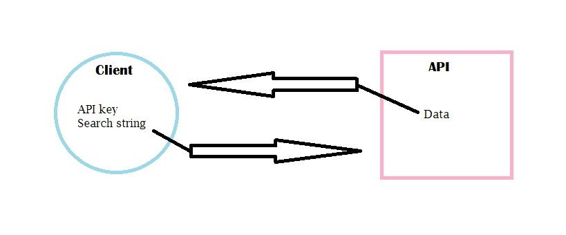
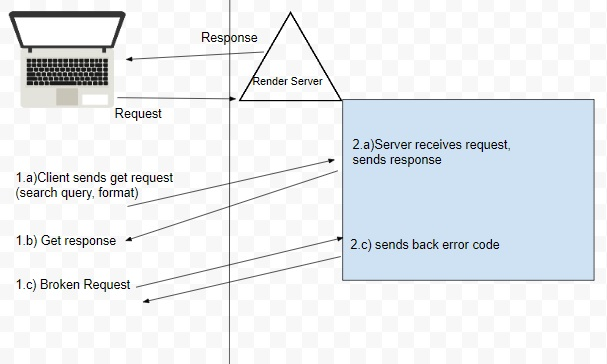

# City-Explorer

**Author**: Laurel Perkins
**Version**: 1.0.0 <!--(increment the patch/fix version number if you make more commits past your first submission)-->

## Overview
<!-- Provide a high level overview of what this application is and why you are building it, beyond the fact that it's an assignment for this class. (i.e. What's your problem domain?) -->

## Getting Started
<!-- What are the steps that a user must take in order to build this app on their own machine and get it running? -->

* 

* 

* 

## Architecture
<!-- Provide a detailed description of the application design. What technologies (languages, libraries, etc) you're using, and any other relevant design information. -->

### Lab-06

* Name of feature: Set Up React Repository and API keys
Estimate of time needed to complete: 1hr
Start time: 1:08PM
Finish time: 1:48PM
Actual time needed to complete: 40min

* Name of feature: Location
Estimate of time needed to complete: 1hr
Start time: 3:26PM
Finish time: 4:30PM
Actual time needed to complete: 1hr, 4min

* Name of feature: Map
Estimate of time needed to complete: 1hr
Start time: 9:03AM
Finish time: 9:34AM
Actual time needed to complete: 31min

* Name of feature: Errors
Estimate of time needed to complete: 1hr
Start time: 9:35AM
Finish time: 9:56AM
Actual time needed to complete: 21min

* Name of feature: Weather (placeholder)
Estimate of time needed to complete: 1hr
Start time: 12:13PM
Finish time: 1:05PM
Actual time needed to complete: 52min

## Change Log

* 03/07/2023 3:58PM server is working!
* 03/07/2023 5:43PM Back-end functional
* 03/08/2023 1:05PM Front-end is functional

## Credit and Collaborations

* <https://github.com/spring-guides/tut-react-and-spring-data-rest/issues/85> for help installing axios and bootstrap,and additing them as dependencies